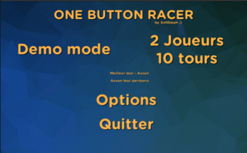
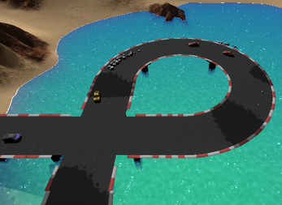
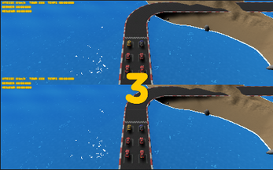

# Unity OneButtonRacer
 Fun Race Game with only Accelerate button - Version 0.11 - Universal Render Pipeline (URP) - Unity 6

Fonctionnalites / Fonctionalities :
    - 1 circuit // 1 track
    - Démo ou Mode 2 joueurs // Demo or 2 players mode
    - Musique de fond // Background music
    - Bruitages // Sounds
    - Configuration des touches // Keybind
    - Gestion des réglages voitures // B-Spec mode
    - MacOs et Windows Builds Ok
    - End / Restart Game / Restart Level

 
